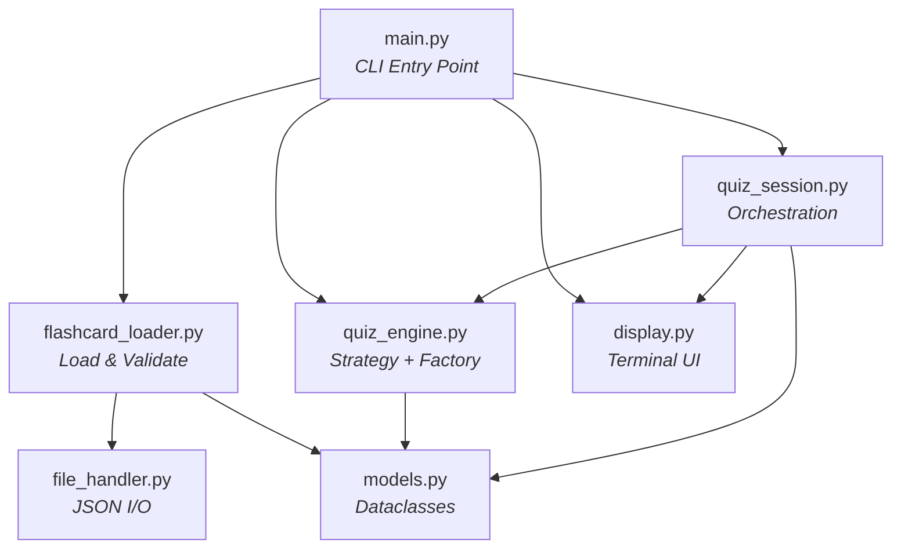
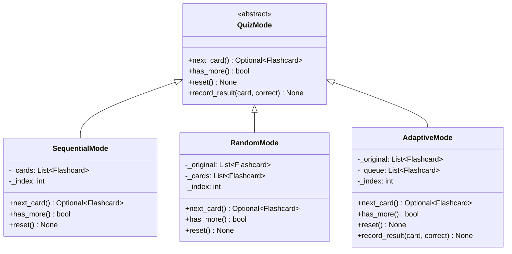
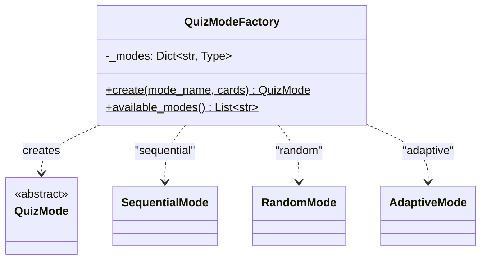
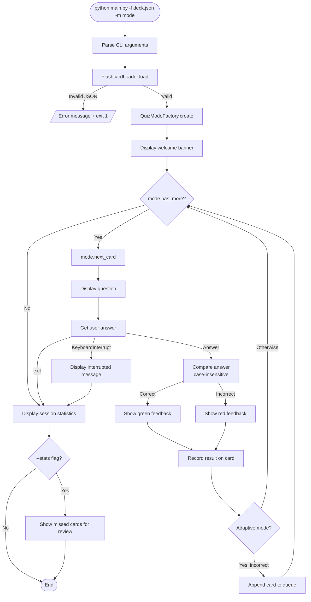
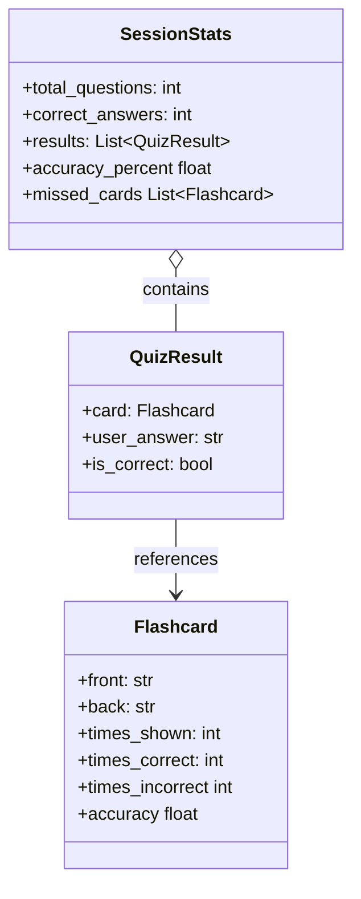

# Flashcard Quizzer CLI

An interactive command-line flashcard application for learning and self-assessment. Supports three quiz modes, colored terminal output, and detailed session statistics.

## Features

- **Three Quiz Modes:** Sequential, Random, and Adaptive
- **Adaptive Learning:** Incorrect cards are automatically re-queued for additional practice
- **Colored Output:** Green for correct, red for incorrect, cyan for questions
- **Session Statistics:** Score, accuracy percentage, and missed-card review
- **Flexible Input:** Supports JSON array and object format flashcard decks
- **Graceful Interrupts:** Ctrl+C shows partial results instead of crashing

## Getting Started

### Prerequisites

- Python 3.8+
- pip

### Installation

```bash
# Create and activate virtual environment
python -m venv venv
source venv/bin/activate  # On Windows: venv\Scripts\activate

# Install dependencies
pip install -r requirements.txt
```

### Usage

```bash
# Sequential quiz (default mode)
python main.py -f data/python_basics.json

# Random order
python main.py -f data/python_basics.json -m random

# Adaptive mode (re-asks incorrect cards)
python main.py -f data/python_basics.json -m adaptive

# Show detailed statistics after the quiz
python main.py -f data/python_basics.json -m adaptive --stats
```

During the quiz, type your answer and press Enter. Type `exit` to quit early. Press Ctrl+C for a graceful interruption with partial results.

### Creating Your Own Flashcards

Flashcard files are JSON. Two formats are supported:

**Array format:**
```json
[
  {"front": "What is Python?", "back": "A programming language"},
  {"front": "What is PEP 8?", "back": "Python's style guide"}
]
```

**Object format:**
```json
{
  "cards": [
    {"front": "What is Python?", "back": "A programming language"}
  ]
}
```

## Architecture

```
starter/
├── main.py                    # CLI entry point (argparse)
├── utils/
│   ├── file_handler.py        # Generic JSON file I/O
│   ├── flashcard_loader.py    # Flashcard loading and validation
│   ├── models.py              # Dataclasses (Flashcard, QuizResult, SessionStats)
│   ├── quiz_engine.py         # Strategy Pattern + Factory Pattern
│   ├── quiz_session.py        # Session orchestration
│   └── display.py             # Terminal UI with color support
├── tests/                     # 55 unit and integration tests
├── data/                      # Sample flashcard decks
└── docs/                      # Project documentation
```

### Module Dependency Diagram



### Design Patterns

#### Strategy Pattern — Quiz Modes



#### Factory Pattern — Mode Creation



### Quiz Session Flowchart



### Data Model Overview



## Testing

```bash
# Run all tests
pytest

# Run with verbose output
pytest -v

# Run with coverage report
pytest --cov=. --cov-report=term-missing

# Generate HTML coverage report
pytest --cov=. --cov-report=html
```

Current test coverage: **94%** across 55 test cases.

## Code Quality

```bash
black .          # Format code
isort .          # Organize imports
flake8 .         # Lint
mypy .           # Type check
```

## Documentation

- `docs/ai_edit_log.md` - Detailed AI interaction log
- `docs/final_report.md` - Project report with architecture and reflection
- `docs/design_patterns.md` - Design pattern reference
- `docs/project_rubric.md` - Assessment rubric

## Built With

- Python 3.8+ with dataclasses and ABC
- pytest + pytest-cov for testing
- Black, isort, flake8 for code quality
- Claude Code for AI-assisted development
